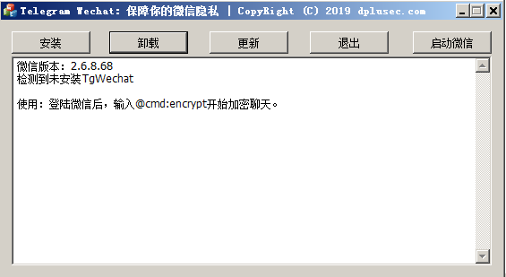
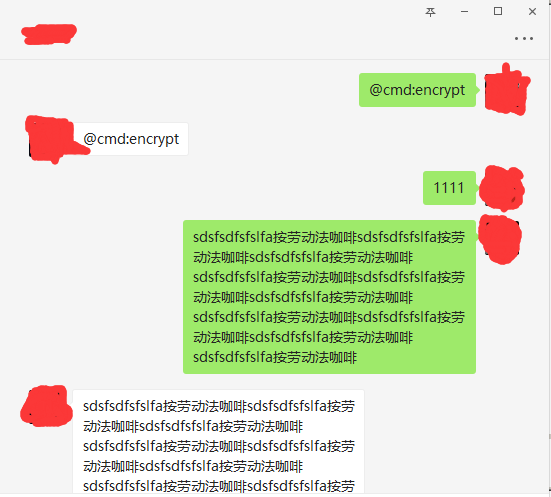

# TgWechat

**仅供个人消遣玩耍，请勿用于非法或者商业用途。若用于非法用途，一切后果由使用者承担，与软件作者无关**

[dpluse.com](https://dplusec.com)

一款采用Telegram类似的安全加密方案实现的保护个人隐私安全的微信聊天插件。

自由切换 端对端加密 安全可靠

不同聊天对象生成不同加密密钥。

随意启用或关闭加密功能。

传输到微信服务器聊天内容是加密的（不怕私密暴露），本地保存内容明文（方便查看）。

功能：

* 默认支持多开
* 支持个人聊天文本内容加密
* 支持内置表情加密
* 支持两人群聊（测试功能，多人聊天还在调试中）
* 支持版本2.6.8.65及以后版本

# 使用方法

## 1、安装

使用TgWechat.exe进行快捷安装，还支持更新、卸载、多开微信。

## 2、使用

登陆微信后，进入正常聊天流程，此时还是明文聊天。

如果想开始加密聊天，输入@cmd:encrypt，对方收到后也回复@cmd:encrypt，后续所有聊天内容开始加密（手机端看到内容为加密的）。

如果想结束加密聊天，任一方输入@cmd:normal即可。

# TODO

* 图片加密
* 文件加密
* 多人群聊
* 支持macos
* ...

感谢[@鬼手](https://github.com/TonyChen56/WeChatRobot)、[@anhkgg](https://github.com/anhkgg/SuperWeChatPC)、[@大魔头](https://bbs.pediy.com/thread-224988.htm)、[@Cirn](https://bbs.pediy.com/thread-223178.htm)以及其他看雪、吾爱大牛无私分享的技术。

如果觉得工具有用，请不吝支持我的工作。

[bitcoin:3MfKfzuK6qMf1NRDH3k1RKp82bnwdhSnFm](bitcoin:3MfKfzuK6qMf1NRDH3k1RKp82bnwdhSnFm)